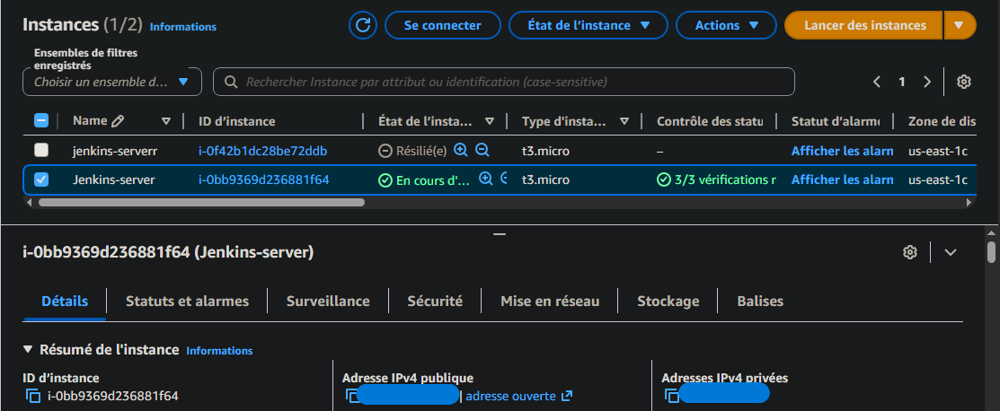
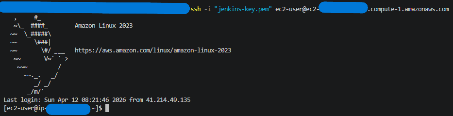
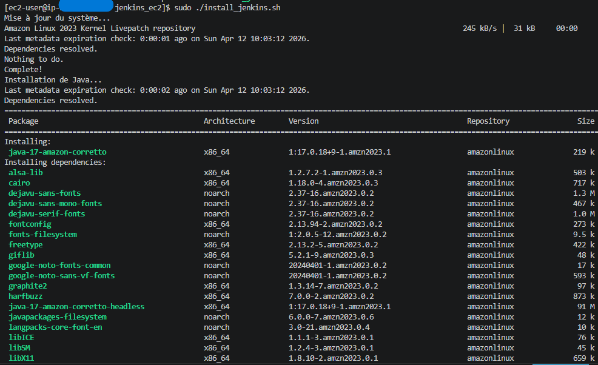
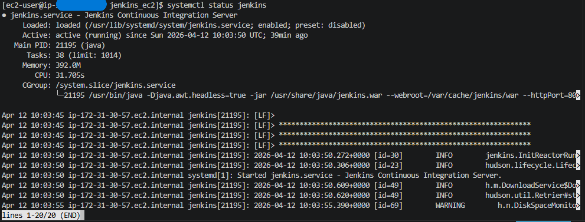
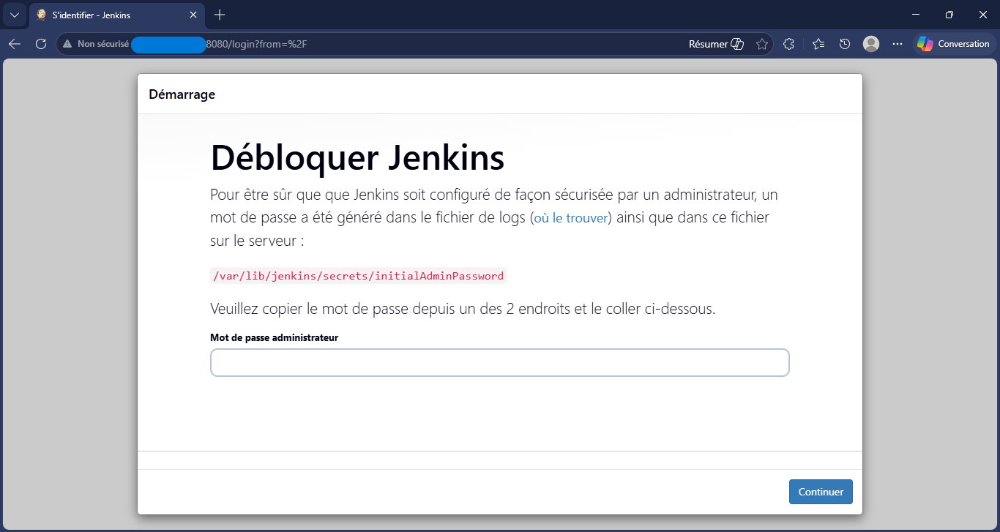
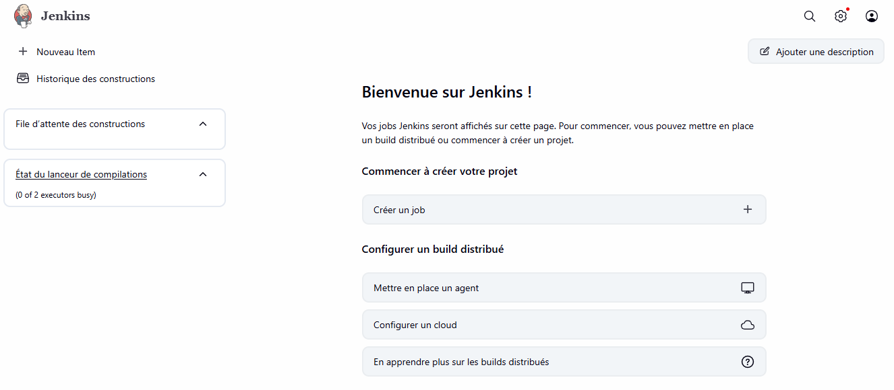

# Jenkins Installation on AWS using Bash Script

## Project Overview
This project demonstrates how to automate the installation and configuration of a Jenkins server on an AWS EC2 instance using a Bash script. The goal is to simulate a real DevOps workflow including cloud provisioning, SSH access, and CI/CD setup.

## Technologies Used
- AWS EC2
- Amazon Linux 2
- Jenkins
- Bash scripting
- SSH

## Prerequisites
Before running this project, ensure you have:
- AWS account with permissions to create EC2 instances
- SSH client (Git Bash, Linux terminal, or Mac terminal)
- AWS Key Pair (.pem file) generated from AWS console
- Security Group configured to allow:
  - SSH (port 22)
  - Jenkins (port 8080)

## Project Steps

### 1. EC2 Instance Creation
- Created an EC2 instance using Amazon Linux 2
- Configured Security Group to allow SSH (22) and Jenkins (8080)

Screenshot:


### 2. SSH Connection to EC2
Connected to the instance using SSH
```bash
ssh -i <your-key.pem> ec2-user@<ec2-public-ip>
```
Screenshot:


### 3. Jenkins Installation Script
The Jenkins installation script was created and executed directly on the EC2 instance.  

Make script executable: 
chmod +x installjenkins.sh

Run the script:
sudo installjenkins.sh

Screenshot:


### 4. Jenkins Service Verification
Check Jenkins service status:
sudo systemctl status jenkins

Screenshot:


### 5. Jenkins Web Access
Access Jenkins in browser:
http://<ec2-public-ip>:8080

Screenshot:


Retrieve initial admin password:
sudo cat /var/lib/jenkins/secrets/initialAdminPassword

### 6. Jenkins Initial Setup
- Installed suggested plugins
- Created admin user
- Completed setup

Screenshot:


## Installation Script
The full script is available in the repository: installjenkins.sh
Excerpt:
```bash
#!/bin/bash

# System Update
sudo yum update -y

# Install Java
sudo yum install -y java-17-amazon-corretto

# Install Jenkins
sudo yum install -y jenkins

# Start Jenkins
sudo systemctl start jenkins
```

## Security Notes
- Sensitive files such as `.pem`, `.key`, and `.env` are excluded using a `.gitignore` file
- Credentials and private keys are never committed to the repository
- Public IP addresses and sensitive information are not hardcoded

## Key Learnings
- AWS EC2 provisioning and configuration
- SSH access to remote servers
- Bash scripting for automation
- Jenkins installation and CI/CD basics
- Security best practices in DevOps

## Future Improvements
- Automate provisioning using Terraform
- Implement Jenkins pipelines
- Integrate GitHub webhooks for CI/CD automation

# Author
MOHAMED Anlinourdine