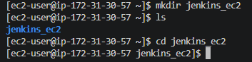

# Jenkins Installation on AWS using Bash Script

## Project Overview
This project demonstrates how to install and configure a Jenkins server on an AWS EC2 instance using a Bash script. The goal is to automate the installation process and simulate a real DevOps environment.

## Technologies Used

- AWS EC2
- Amazon Linux
- Jenkins
- Bash scripting
- SSH

## Project Steps

### 1. EC2 Instance Creation

- Created an EC2 instance on AWS
- Configured Security Group (SSH + Port 8080)


### 2. SSH Connection

- Connected to the instance using SSH


### 3. Script Creation

- Created a Bash script to automate Jenkins installation



### 4. Script Execution

- Executed the script to install Jenkins


### 5. Jenkins Service Verification

- Verified Jenkins is running


### 6. Jenkins Web Access

- Accessed Jenkins via browser


### 7. Initial Configuration

- Installed plugins and created admin user


## Script

```bash
#!/bin/bash

# System Update
echo "System update..."
sudo yum update -y

# Install Java (required for Jenkins)
echo "Installing Java..."
sudo yum install -y java-17-amazon-corretto

# Add Jenkins Repo
echo "Adding Jenkins repository..."
sudo wget -O /etc/yum.repos.d/jenkins.repo https://pkg.jenkins.io/redhat-stable/jenkins.repo

# Import Jenkins Key
sudo rpm --import https://pkg.jenkins.io/redhat-stable/jenkins.io-2023.key

# Install Jenkins
echo "Installing Jenkins..."
sudo yum install -y jenkins

# Start Jenkins
echo "Starting Jenkins service..."
sudo systemctl start jenkins

# Enable Jenkins Startup
sudo systemctl enable jenkins

# Check status
echo "Jenkins status:"
sudo systemctl status jenkins

# Display initial password
echo "Jenkins initial password:"
sudo cat /var/lib/jenkins/secrets/initialAdminPassword

```

## Key Learnings

- Automating infrastructure setup using Bash
- Installing and configuring Jenkins
- Working with AWS EC2
- Understanding CI/CD basics

## Future Improvements

- Automate with Terraform
- Add Jenkins pipelines
- Integrate with GitHub

# Author
MOHAMED Anlinourdine